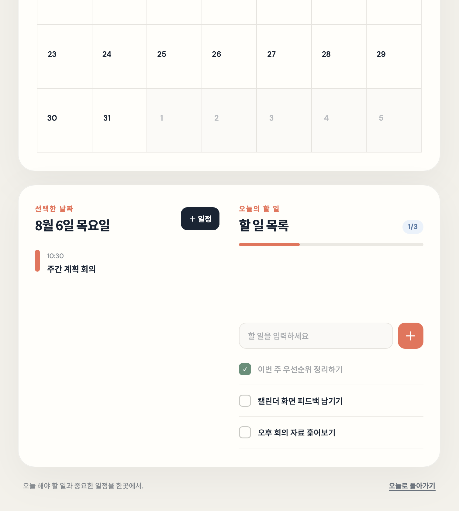
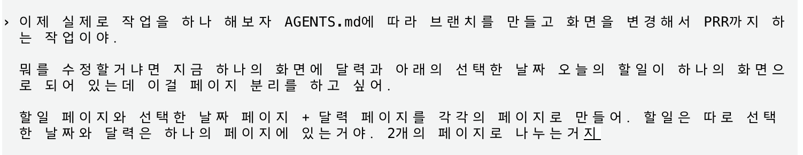
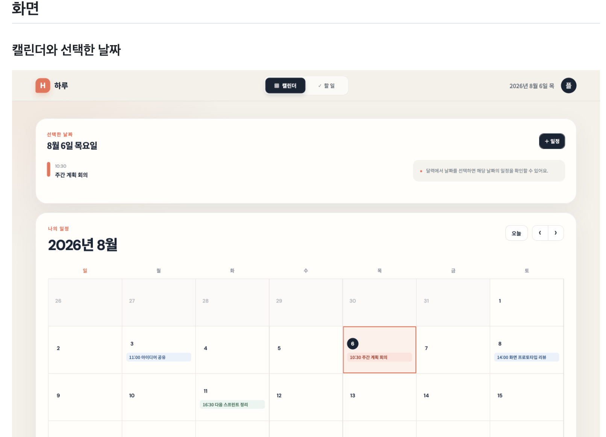
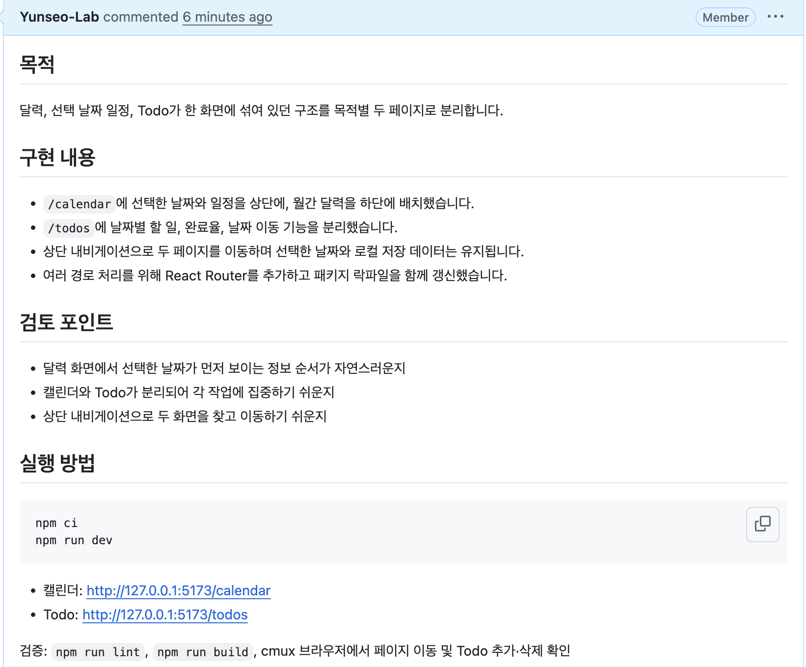

# 코딩 에이전트와 화면 아이디어 검증하기

이 저장소는 완성된 제품을 한 번에 만드는 곳이 아닙니다. 떠오른 아이디어를 작은 화면으로 빠르게 구현하고, PR에서 팀과 함께 필요성을 검토하는 공간입니다.

작업 흐름은 단순합니다.

```text
main → 작업 브랜치 → 화면 변경과 검증 → PR → 함께 검토 → merge 또는 폐기
```

세부 기술 기준과 완료 조건은 [AGENTS.md](../AGENTS.md)에 이미 정리되어 있습니다. 개발자는 만들고 싶은 화면과 검토할 포인트에 집중하고, 코딩 에이전트에게 `AGENTS.md`를 따르도록 요청하면 됩니다.

## 1. 최신 main에서 시작하기

모든 작업은 최신 `main`을 기준으로 시작합니다. 코딩 에이전트에게 먼저 다음과 같이 요청합니다.

```text
AGENTS.md를 읽고 지침에 따라 작업해줘.
최신 main에서 작업 목적에 맞는 새 브랜치를 만들고,
구현과 검증 후 커밋, 푸시, PR 생성까지 진행해줘.
```

브랜치는 작업 목적에 맞게 구분합니다.

- `screen/`: 단일 화면을 만들거나 수정할 때
- `flow/`: 여러 단계의 사용자 흐름을 검증할 때
- `experiment/`: 아이디어를 가볍게 실험할 때

## 2. 바꾸고 싶은 화면을 설명하기

완성된 기획서가 없어도 괜찮습니다. 현재 화면에서 불편한 점과 원하는 결과를 자연어로 설명하면 됩니다.

이번 사례에서는 달력, 선택한 날짜의 일정, Todo가 한 화면에 함께 있었습니다.



개발자는 다음처럼 화면을 두 페이지로 분리해 달라고 요청했습니다.



좋은 요청에는 다음 세 가지가 드러나면 충분합니다.

- 현재 어떤 화면 또는 흐름이 있는가?
- 무엇을 어떻게 바꾸고 싶은가?
- 변경 후 어떤 점을 검토하고 싶은가?

예시를 텍스트로 정리하면 다음과 같습니다.

```text
AGENTS.md에 따라 새 브랜치에서 작업해줘.

현재 달력, 선택한 날짜의 일정, Todo가 한 화면에 있어.
Todo는 별도 페이지로 분리하고,
달력과 선택한 날짜의 일정은 하나의 페이지에 남겨줘.

두 페이지를 쉽게 이동할 수 있게 만들고,
검증 후 주요 화면을 캡처해서 PR까지 생성해줘.
```

## 3. 에이전트가 구현하고 검증하기

에이전트는 [AGENTS.md](../AGENTS.md)를 기준으로 다음 작업을 진행합니다.

1. 최신 `main`에서 작업 브랜치를 만듭니다.
2. 기존 기술 스택과 버전을 유지하며 화면을 변경합니다.
3. 주요 상태와 상호작용을 직접 확인합니다.
4. lint와 build를 통과시킵니다.
5. 변경된 주요 화면을 캡처합니다.
6. 변경사항을 커밋하고 원격 브랜치에 푸시합니다.
7. 목적과 검토 포인트, 실행 방법, 화면 캡처가 담긴 PR을 만듭니다.

이번 작업에서는 다음과 같이 변경되었습니다.

- `/calendar`: 선택한 날짜와 일정을 위에, 월간 달력을 아래에 배치
- `/todos`: 날짜별 할 일과 완료율을 별도 페이지로 분리
- 상단 내비게이션으로 두 페이지 이동
- 선택한 날짜와 브라우저 저장 데이터 유지

## 4. PR에서 결과 확인하기

작업이 끝나면 코드보다 먼저 PR의 목적과 실제 화면을 확인합니다. 화면 캡처를 통해 아이디어가 의도대로 구현됐는지 빠르게 판단할 수 있습니다.



PR 본문에는 다음 내용이 포함됩니다.

- 왜 이 화면을 변경했는지
- 무엇이 달라졌는지
- 팀이 함께 결정해야 할 검토 포인트
- 로컬에서 실행하는 방법
- 주요 변경 화면 캡처



팀은 PR을 보고 화면이 실제로 필요한지 이야기합니다. 아이디어가 유효하면 `main`에 병합하고, 그렇지 않다면 수정하거나 브랜치를 폐기합니다. 빠르게 만들었기 때문에 빠르게 버릴 수도 있다는 점이 이 저장소의 중요한 원칙입니다.

## 바로 사용할 수 있는 요청 형식

새로운 화면 아이디어가 생기면 아래 형식을 복사해 사용합니다.

```text
AGENTS.md를 읽고 지침에 따라 새 브랜치에서 작업해줘.

현재 상태:
- 지금 화면이나 흐름을 간단히 설명

원하는 변경:
- 만들거나 바꾸고 싶은 화면을 설명

검토 포인트:
- PR에서 팀과 확인하고 싶은 질문

구현 후 실제 화면을 검증하고 캡처한 뒤,
커밋, 푸시, PR 생성까지 진행해줘.
```

핵심은 자세한 기술 지시가 아니라, **현재 상태와 원하는 변화, 검토할 질문을 명확히 전달하는 것**입니다. 구현 방법과 작업 절차는 저장소의 `AGENTS.md`가 에이전트에게 안내합니다.
